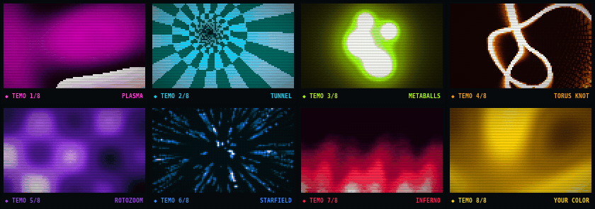

# TEMO

A terminal demoscene in pure Go, built entirely on
[Charm](https://charm.sh) libraries — [Bubble Tea](https://github.com/charmbracelet/bubbletea)
runs the loop, [Harmonica](https://github.com/charmbracelet/harmonica) springs drive the
beat pulse and scene wipes, [Lip Gloss](https://github.com/charmbracelet/lipgloss) dresses
the chrome.

Seven classic effects rendered as half-block "pixels" (double vertical
resolution), all themed live from **one configurable primary color**.

[](https://github.com/jpillora/temo/actions/workflows/ci.yml)
[](https://github.com/jpillora/temo/releases/latest)
[](https://github.com/jpillora/temo/releases)

<p align="center">
  
</p>

```
go run . -primary '#00D8FF'
```

## The scenes

1. **PLASMA** — layered sine fields with palette cycling
2. **TUNNEL** — fly through a twisting checkered tube
3. **METABALLS** — molten blobs on Lissajous orbits
4. **TORUS KNOT** — a (2,3) knot of light tumbling in 3D, with motion trails and a comet
5. **ROTOZOOM** — an infinite texture rotating and breathing
6. **STARFIELD** — hyperspace with motion-blur streaks
7. **INFERNO** — convection fire, stoked by wandering hot clumps

Scenes auto-advance with a diagonal spring-driven wipe, a sine-wave greetings
scroller rides the bottom, and everything pulses gently on the beat.

## The color

The only requirement, honored everywhere: pass any primary color and TEMO
derives its entire 256-step palette from it — near-black shadows sweep through
the deep and pure primary up to a tinted white, with a little hue drift so
gradients feel rich. The status bar, scroller, help panel, and every scene
follow.

```sh
temo                          # hot magenta (default)
temo -primary '#00D8FF'       # electric cyan
temo -primary amber           # firewatch
temo cyan                     # positional works too
```

Named colors: red, orange, amber, yellow, lime, green, teal, cyan, blue,
indigo, violet, purple, magenta, pink, rose, white.

## Install

Download a prebuilt archive for your platform from the
[latest release](https://github.com/jpillora/temo/releases/latest), or use the
installer:

```sh
curl https://i.jpillora.com/temo! | bash
```

With Go installed, build and install the latest release from source:

```sh
go install github.com/jpillora/temo@latest
```

Or run the multi-platform container image in an interactive terminal:

```sh
docker run --rm -it ghcr.io/jpillora/temo:latest
```

The GHCR package is public, so anonymous pulls work without a registry login.

Release archives cover Linux, macOS, Windows, the BSDs, illumos, Solaris,
AIX, and every applicable architecture supported by Go. The container image
covers eight Linux platforms: 386, amd64, ARMv6, ARMv7, ARM64, PPC64LE,
RISC-V 64, and s390x.

## Controls

| key         | action            |
| ----------- | ----------------- |
| `SPACE` `→` | next scene        |
| `←`         | previous scene    |
| `1`–`7`     | jump to scene     |
| `P`         | pause             |
| `C`         | CRT scanlines     |
| `S`         | scroller          |
| `H` `?`     | help              |
| `Q` `ESC`   | quit              |

## Flags

| flag        | default   | meaning                                   |
| ----------- | --------- | ----------------------------------------- |
| `-primary`  | `#FF5FD2` | primary color (hex or name); `-p` works   |
| `-fps`      | `30`      | target frame rate (10–60)                 |
| `-bpm`      | `128`     | beat-pulse tempo                          |
| `-dwell`    | `12`      | seconds per scene, `0` to stay put        |
| `-scene`    | `1`       | starting scene                            |
| `-scroller` | `true`    | greetings scroller                        |
| `-selftest` | `false`   | headless render + stats, for development  |
| `-version`  | `false`   | print the build version and exit           |

## How it works

Each terminal cell is drawn as `▀` with independent foreground and background
truecolor, so a `W×H` terminal becomes a `W×(2H)` square-ish pixel grid.
Scenes write 8-bit indices into that grid; the compositor maps them through
the palette LUT, applies the scene-wipe blend, beat-pulse brightness, vignette
and scanlines, then serializes with change-only ANSI emission.

A truecolor terminal is expected (any modern one: kitty, alacritty, wezterm,
ghostty, iTerm2, Windows Terminal, recent gnome/konsole).

### Development

```sh
go test ./...                                    # scene sanity + geometry + color parsing
TEMO_PNG_DIR=/tmp/temo go test -run DumpPNG      # dump every scene to PNG for eyeballing
TEMO_PNG_COLOR=cyan TEMO_PNG_DIR=/tmp/t go test -run DumpPNG
```

Releases are automated with GoReleaser and ko—no Docker daemon is involved.
Push a semantic-version tag to publish the GitHub release archives and the
matching `ghcr.io/jpillora/temo` image tags:

```sh
git tag v0.1.0
git push origin v0.1.0
```
